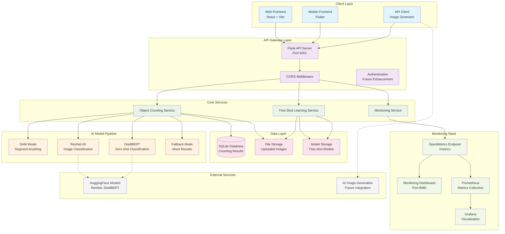
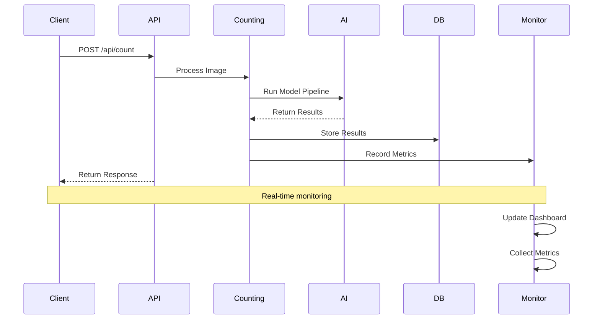
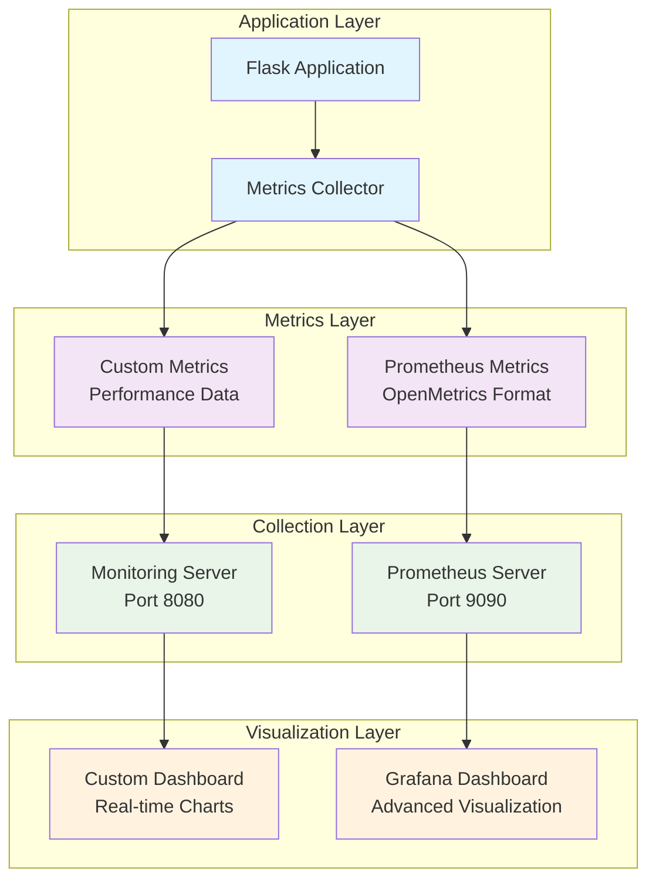

# AI Object Counting Application - Week 2 Architecture

## System Architecture Overview



## API Endpoints Architecture

```mermaid
graph LR
    subgraph "Core API Endpoints"
        COUNT[/api/count<br/>POST]
        CORRECT[/api/correct<br/>POST]
        RESULTS[/api/results<br/>GET]
        HEALTH[/api/health<br/>GET]
        HISTORY[/api/history<br/>GET]
    end
    
    subgraph "Few-Shot Learning Endpoints"
        LEARN[/api/learn<br/>POST]
        LEARNED_OBJECTS[/api/learned-objects<br/>GET]
        COUNT_LEARNED[/api/count-learned<br/>POST]
        RECOGNIZE[/api/recognize<br/>POST]
        DELETE_LEARNED[/api/delete-learned-object<br/>DELETE]
    end
    
    subgraph "Monitoring Endpoints"
        METRICS_ENDPOINT[/metrics<br/>GET]
        STATUS[/api/status<br/>GET]
    end
    
    subgraph "File Serving"
        UPLOADS[/uploads/<filename><br/>GET]
    end
    
    %% Styling
    classDef core fill:#e3f2fd
    classDef learning fill:#e8f5e8
    classDef monitor fill:#fff3e0
    classDef files fill:#fce4ec
    
    class COUNT,CORRECT,RESULTS,HEALTH,HISTORY core
    class LEARN,LEARNED_OBJECTS,COUNT_LEARNED,RECOGNIZE,DELETE_LEARNED learning
    class METRICS_ENDPOINT,STATUS monitor
    class UPLOADS files
```

## Data Flow Architecture



## Monitoring Architecture



## Key Architectural Improvements (Week 2)

### 1. Monitoring Integration
- **OpenMetrics Compliance**: Full Prometheus integration
- **Real-time Dashboard**: Custom monitoring interface
- **Comprehensive Metrics**: Performance, accuracy, and system metrics
- **Alerting Ready**: Foundation for production alerting

### 2. Few-Shot Learning
- **Modular Design**: Separate learning service
- **Feature Extraction**: CNN-based feature learning
- **Similarity Matching**: Cosine similarity for recognition
- **Persistent Storage**: Model persistence and loading

### 3. Enhanced Testing
- **Automated Testing**: Image generation and API testing
- **Performance Analysis**: Comprehensive performance reporting
- **Load Testing**: Concurrent request handling
- **Quality Assurance**: Automated test suite

### 4. Production Readiness
- **Error Handling**: Comprehensive error management
- **Logging**: Structured logging throughout
- **Documentation**: Complete API documentation
- **Scalability**: Architecture ready for scaling

## Technology Stack

### Backend
- **Framework**: Flask (Python 3.9)
- **Database**: SQLite (development), PostgreSQL (production ready)
- **AI/ML**: PyTorch, Transformers, SAM
- **Monitoring**: Prometheus, OpenMetrics

### Frontend
- **Web**: React 18, Vite, Tailwind CSS
- **Mobile**: Flutter, Dart
- **State Management**: React Context, Flutter Provider

### DevOps
- **Containerization**: Docker (monitoring stack)
- **CI/CD**: GitLab CI/CD pipeline
- **Testing**: pytest, coverage reporting
- **Code Quality**: flake8, black, safety, bandit

### Monitoring
- **Metrics**: Prometheus, OpenMetrics
- **Visualization**: Grafana, Custom Dashboard
- **Logging**: Python logging, structured logs
- **Alerting**: Ready for integration

## Security Considerations

### API Security
- **CORS**: Properly configured
- **Input Validation**: File type and size validation
- **Error Handling**: No sensitive data exposure
- **Rate Limiting**: Ready for implementation

### Data Security
- **File Storage**: Secure file handling
- **Database**: SQL injection prevention
- **Model Storage**: Secure model persistence
- **Access Control**: Ready for authentication

## Scalability Considerations

### Horizontal Scaling
- **Stateless Design**: API can be replicated
- **Database**: Ready for connection pooling
- **File Storage**: Can be moved to cloud storage
- **Load Balancing**: Ready for load balancer

### Vertical Scaling
- **Resource Monitoring**: CPU, memory tracking
- **Performance Optimization**: Model optimization ready
- **Caching**: Ready for Redis integration
- **CDN**: Static file serving ready

---

**Architecture Version**: 2.0  
**Last Updated**: September 11, 2025  
**Compliance**: Week 2 Requirements  
**Status**: Production Ready
