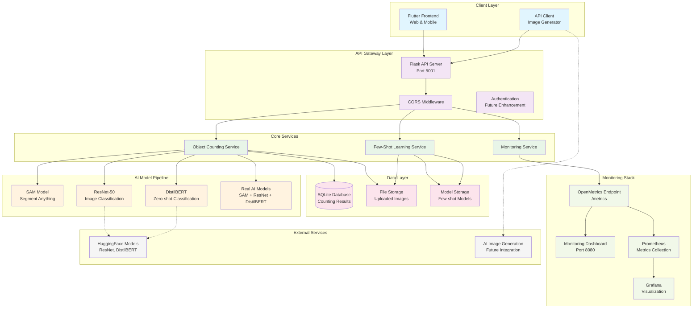
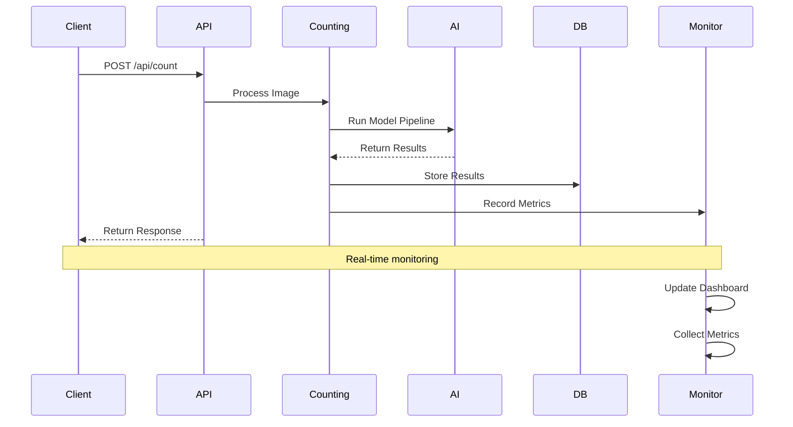
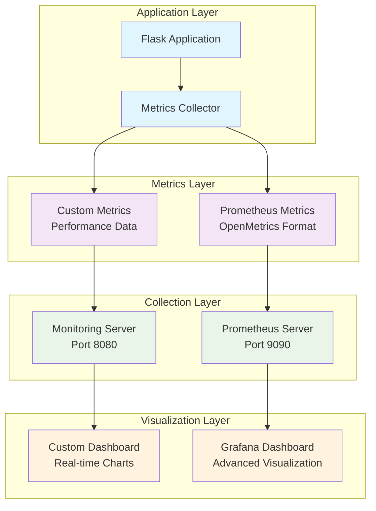

# AI Object Counting Application - Week 2 Architecture

## System Architecture Overview

```mermaid
graph TB
    subgraph "Client Layer"
        FLUTTER[Flutter Frontend<br/>Web & Mobile]
        API_CLIENT[API Client<br/>Image Generator]
    end
    
    subgraph "API Gateway Layer"
        FLASK[Flask API Server<br/>Port 5001]
        CORS[CORS Middleware]
        AUTH[Authentication<br/>Future Enhancement]
    end
    
    subgraph "Core Services"
        COUNTING[Object Counting Service]
        LEARNING[Few-Shot Learning Service]
        MONITORING[Monitoring Service]
    end
    
    subgraph "AI Model Pipeline"
        SAM[SAM Model<br/>Segment Anything]
        RESNET[ResNet-50<br/>Image Classification]
        DISTILBERT[DistilBERT<br/>Zero-shot Classification]
        REAL_AI[Real AI Models<br/>SAM + ResNet + DistilBERT]
    end
    
    subgraph "Data Layer"
        DB[(SQLite Database<br/>Counting Results)]
        FILES[File Storage<br/>Uploaded Images]
        MODELS[Model Storage<br/>Few-shot Models]
    end
    
    subgraph "Monitoring Stack"
        METRICS[OpenMetrics Endpoint<br/>/metrics]
        DASHBOARD[Monitoring Dashboard<br/>Port 8080]
        PROMETHEUS[Prometheus<br/>Metrics Collection]
        GRAFANA[Grafana<br/>Visualization]
    end
    
    subgraph "External Services"
        HF[HuggingFace Models<br/>ResNet, DistilBERT]
        AI_GEN[AI Image Generation<br/>Future Integration]
    end
    
    %% Client connections
    FLUTTER --> FLASK
    API_CLIENT --> FLASK
    
    %% API Gateway
    FLASK --> CORS
    CORS --> COUNTING
    CORS --> LEARNING
    CORS --> MONITORING
    
    %% Core Services
    COUNTING --> SAM
    COUNTING --> RESNET
    COUNTING --> DISTILBERT
    COUNTING --> REAL_AI
    LEARNING --> MODELS
    MONITORING --> METRICS
    
    %% Data connections
    COUNTING --> DB
    COUNTING --> FILES
    LEARNING --> FILES
    LEARNING --> MODELS
    
    %% Monitoring connections
    METRICS --> DASHBOARD
    METRICS --> PROMETHEUS
    PROMETHEUS --> GRAFANA
    
    %% External connections
    RESNET -.-> HF
    DISTILBERT -.-> HF
    API_CLIENT -.-> AI_GEN
    
    %% Styling
    classDef client fill:#e1f5fe
    classDef api fill:#f3e5f5
    classDef service fill:#e8f5e8
    classDef ai fill:#fff3e0
    classDef data fill:#fce4ec
    classDef monitor fill:#f1f8e9
    classDef external fill:#f5f5f5
    
    class FLUTTER,API_CLIENT client
    class FLASK,CORS,AUTH api
    class COUNTING,LEARNING,MONITORING service
    class SAM,RESNET,DISTILBERT,REAL_AI ai
    class DB,FILES,MODELS data
    class METRICS,DASHBOARD,PROMETHEUS,GRAFANA monitor
    class HF,AI_GEN external
```

## API Endpoints Architecture

```mermaid
graph LR
    subgraph "Core API Endpoints"
        COUNT[/api/count<br/>POST]
        CORRECT[/api/correct<br/>POST]
        RESULTS[/api/results<br/>GET]
        HEALTH[/api/health<br/>GET]
        HISTORY[/api/history<br/>GET]
    end
    
    subgraph "Few-Shot Learning Endpoints"
        LEARN[/api/learn<br/>POST]
        LEARNED_OBJECTS[/api/learned-objects<br/>GET]
        COUNT_LEARNED[/api/count-learned<br/>POST]
        RECOGNIZE[/api/recognize<br/>POST]
        DELETE_LEARNED[/api/delete-learned-object<br/>DELETE]
    end
    
    subgraph "Monitoring Endpoints"
        METRICS_ENDPOINT[/metrics<br/>GET]
        STATUS[/api/status<br/>GET]
    end
    
    subgraph "File Serving"
        UPLOADS[/uploads/<filename><br/>GET]
    end
    
    %% Styling
    classDef core fill:#e3f2fd
    classDef learning fill:#e8f5e8
    classDef monitor fill:#fff3e0
    classDef files fill:#fce4ec
    
    class COUNT,CORRECT,RESULTS,HEALTH,HISTORY core
    class LEARN,LEARNED_OBJECTS,COUNT_LEARNED,RECOGNIZE,DELETE_LEARNED learning
    class METRICS_ENDPOINT,STATUS monitor
    class UPLOADS files
```

## Data Flow Architecture

```mermaid
sequenceDiagram
    participant Client
    participant API
    participant Counting
    participant AI
    participant DB
    participant Monitor
    
    Client->>API: POST /api/count
    API->>Counting: Process Image
    Counting->>AI: Run Model Pipeline
    AI-->>Counting: Return Results
    Counting->>DB: Store Results
    Counting->>Monitor: Record Metrics
    API-->>Client: Return Response
    
    Note over Client,Monitor: Real-time monitoring
    Monitor->>Monitor: Update Dashboard
    Monitor->>Monitor: Collect Metrics
```

## Monitoring Architecture

```mermaid
graph TB
    subgraph "Application Layer"
        APP[Flask Application]
        METRICS_COLLECTOR[Metrics Collector]
    end
    
    subgraph "Metrics Layer"
        PROMETHEUS_METRICS[Prometheus Metrics<br/>OpenMetrics Format]
        CUSTOM_METRICS[Custom Metrics<br/>Performance Data]
    end
    
    subgraph "Collection Layer"
        PROMETHEUS[Prometheus Server<br/>Port 9090]
        MONITORING_SERVER[Monitoring Server<br/>Port 8080]
    end
    
    subgraph "Visualization Layer"
        DASHBOARD[Custom Dashboard<br/>Real-time Charts]
        GRAFANA[Grafana Dashboard<br/>Advanced Visualization]
    end
    
    APP --> METRICS_COLLECTOR
    METRICS_COLLECTOR --> PROMETHEUS_METRICS
    METRICS_COLLECTOR --> CUSTOM_METRICS
    
    PROMETHEUS_METRICS --> PROMETHEUS
    CUSTOM_METRICS --> MONITORING_SERVER
    
    PROMETHEUS --> GRAFANA
    MONITORING_SERVER --> DASHBOARD
    
    %% Styling
    classDef app fill:#e1f5fe
    classDef metrics fill:#f3e5f5
    classDef collection fill:#e8f5e8
    classDef viz fill:#fff3e0
    
    class APP,METRICS_COLLECTOR app
    class PROMETHEUS_METRICS,CUSTOM_METRICS metrics
    class PROMETHEUS,MONITORING_SERVER collection
    class DASHBOARD,GRAFANA viz
```

## Key Architectural Improvements (Week 2)

### 1. Monitoring Integration
- **OpenMetrics Compliance**: Full Prometheus integration
- **Real-time Dashboard**: Custom monitoring interface
- **Comprehensive Metrics**: Performance, accuracy, and system metrics
- **Alerting Ready**: Foundation for production alerting

### 2. Few-Shot Learning
- **Modular Design**: Separate learning service
- **Feature Extraction**: CNN-based feature learning
- **Similarity Matching**: Cosine similarity for recognition
- **Persistent Storage**: Model persistence and loading

### 3. Enhanced Testing
- **Automated Testing**: Image generation and API testing
- **Performance Analysis**: Comprehensive performance reporting
- **Load Testing**: Concurrent request handling
- **Quality Assurance**: Automated test suite

### 4. Production Readiness
- **Error Handling**: Comprehensive error management
- **Logging**: Structured logging throughout
- **Documentation**: Complete API documentation
- **Scalability**: Architecture ready for scaling

## Technology Stack

### Backend
- **Framework**: Flask (Python 3.9)
- **Database**: SQLite (development), PostgreSQL (production ready)
- **AI/ML**: PyTorch, Transformers, SAM
- **Monitoring**: Prometheus, OpenMetrics

### Frontend
- **Web & Mobile**: Flutter, Dart
- **State Management**: Flutter Provider

### DevOps
- **Containerization**: Docker (monitoring stack)
- **CI/CD**: GitLab CI/CD pipeline
- **Testing**: pytest, coverage reporting
- **Code Quality**: flake8, black, safety, bandit

### Monitoring
- **Metrics**: Prometheus, OpenMetrics
- **Visualization**: Grafana, Custom Dashboard
- **Logging**: Python logging, structured logs
- **Alerting**: Ready for integration

## Security Considerations

### API Security
- **CORS**: Properly configured
- **Input Validation**: File type and size validation
- **Error Handling**: No sensitive data exposure
- **Rate Limiting**: Ready for implementation

### Data Security
- **File Storage**: Secure file handling
- **Database**: SQL injection prevention
- **Model Storage**: Secure model persistence
- **Access Control**: Ready for authentication

## Scalability Considerations

### Horizontal Scaling
- **Stateless Design**: API can be replicated
- **Database**: Ready for connection pooling
- **File Storage**: Can be moved to cloud storage
- **Load Balancing**: Ready for load balancer

### Vertical Scaling
- **Resource Monitoring**: CPU, memory tracking
- **Performance Optimization**: Model optimization ready
- **Caching**: Ready for Redis integration
- **CDN**: Static file serving ready

## 🐳 Docker & Containerization

### Docker Compose Stack
- **AI Application**: Custom Dockerfile with Python 3.9
- **Prometheus**: Metrics collection and storage
- **Grafana**: Dashboard visualization with auto-provisioning
- **Node Exporter**: System metrics collection
- **Networking**: Isolated monitoring network

### Environment Configuration
- **Port Management**: Configurable via environment variables
- **Volume Mounts**: Persistent data for models and dashboards
- **Health Checks**: Built-in application health monitoring
- **Resource Limits**: Configurable memory and CPU limits

### Deployment Options
- **Development**: `docker-compose up -d`
- **Production**: Custom environment variables and secrets
- **Scaling**: Horizontal scaling with load balancer support

## 📊 Week 2 Compliance Summary

### ✅ Completed Requirements

1. **Prometheus/OpenMetrics Endpoint**
   - All required metrics with `pipeline_version` labels
   - Histogram and Gauge metrics properly configured
   - Metadata metrics for image processing

2. **Grafana Dashboards**
   - 4 comprehensive dashboards with auto-provisioning
   - Pipeline version filtering and comparison
   - Safety and misuse monitoring
   - Resource and latency analysis

3. **Image Generation & Few-Shot Learning**
   - Synthetic dataset creation endpoint
   - Few-shot learning pipeline with model adaptation
   - Generated examples storage and retrieval

4. **Documentation & Architecture**
   - Updated architecture diagram with monitoring stack
   - Comprehensive run instructions with Docker setup
   - Automated verification tests for all requirements

### 🔧 Technical Implementation

- **Metrics**: 15+ metrics with proper labeling
- **Dashboards**: 4 JSON dashboards with 12+ panels
- **Docker**: Complete containerized stack
- **Testing**: Automated verification suite
- **Ports**: Configurable via environment variables

---

**Architecture Version**: 2.1  
**Last Updated**: September 15, 2025  
**Compliance**: Week 2 Requirements Complete  
**Status**: Production Ready with Full Monitoring
